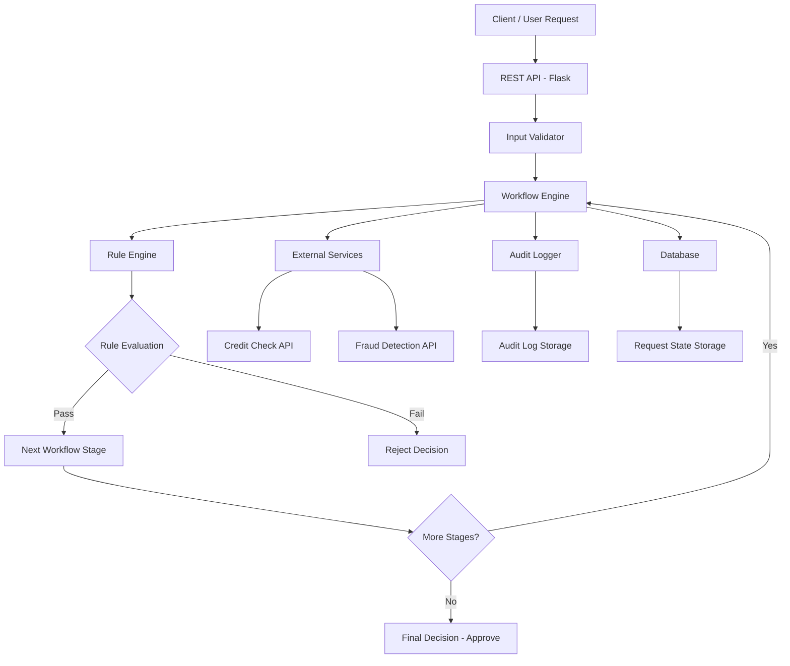

# hackathon_assignment_scoreme
Building a Confurigable workflow decision platform capable of handling Real-world business workflows under ambiguity, changing requirements, and operational constraints

This project implements a **Configurable Workflow Decision Platform** that evaluates incoming requests using rule-based workflows. The system processes structured inputs, applies configurable rules, and moves requests through multiple workflow stages before producing a final decision.

The platform is designed to simulate real-world enterprise decision systems such as:

* Loan approval systems
* Insurance claim processing
* Vendor onboarding workflows
* Compliance verification systems

The main objective is to create a **flexible and scalable decision engine** where business logic can be updated without modifying application code.

---

# Problem Statement

Organizations often need to process large volumes of requests that require structured decision-making. Traditional systems embed decision logic directly in code, making them difficult to update when business rules change.

This project solves that problem by building a **rule-driven workflow engine** where:

* Rules are configurable
* Workflow stages are dynamic
* Decisions are transparent and auditable

The platform ensures **automation, transparency, and scalability** in complex decision workflows.

---

# Key Features

* Configurable rule engine
* Multi-stage workflow execution
* Idempotent request handling
* Retry mechanism for external services
* Manual review stage support
* Full audit trail for decision explanation
* Dynamic configuration using YAML files

---

# System Architecture

```
## System Architecture



### Components Explained

**Client / User Request**
The system receives structured requests (JSON format) from users or external systems.

**REST API (Flask)**
Handles incoming HTTP requests and forwards them to the workflow engine.

**Input Validator**
Ensures the request data matches the expected schema before processing.

**Workflow Engine**
Controls the lifecycle of the request and manages transitions between stages.

**Rule Engine**
Evaluates configurable rules loaded from YAML configuration files.

**External Services**
Simulated services such as credit score checks or fraud detection APIs.

**Audit Logger**
Records every rule evaluation and workflow transition for full decision transparency.

**Database**
Stores request states, audit logs, and workflow history.

---

### Workflow Execution

1. Request received through API
2. Input validation performed
3. Rules evaluated in workflow stages
4. External services checked if required
5. Decision generated (Approve / Reject / Retry / Manual Review)
6. Audit log recorded for traceability

```

### Components

**REST API**
Handles incoming requests and exposes endpoints for workflow execution.

**Workflow Engine**
Controls request lifecycle, stage transitions, and retry handling.

**Rules Engine**
Evaluates validation and decision rules dynamically.

**Configuration Loader**
Loads rule and workflow definitions from YAML configuration files.

**Database Layer**
Stores workflow states, audit logs, and request history.

---

# Technology Stack

* Python
* Flask
* YAML Configuration
* SQLite Database
* REST API Architecture

---

# Project Structure

```
workflow-decision-platform
│
├── app.py
├── requirements.txt
│
├── configs
│   └── workflow.yaml
│
├── docs
│   ├── ARCHITECTURE.md
│   └── DECISION_EXAMPLES.md
│
└── README.md
```

---

# Installation and Setup

Clone the repository:

```
git clone https://github.com/yourusername/workflow-decision-platform.git
cd workflow-decision-platform
```

Install dependencies:

```
pip install -r requirements.txt
```

Run the application:

```
python app.py
```

The API server will start locally.

---

# Example Request

```
{
 "applicant_id": "12345",
 "age": 30,
 "income": 60000,
 "loan_amount": 200000,
 "loan_purpose": "home"
}
```

---

# Example Decision Output

```
{
 "decision": "APPROVED",
 "reason": "All validation and risk checks passed",
 "workflow_stage": "FINAL_APPROVAL"
}
```

---

# Example Decision Flow

1. Request received through API
2. Input validation performed
3. Rules engine evaluates conditions
4. Workflow transitions through stages:

   * Intake Validation
   * Financial Assessment
   * Risk Screening
   * Document Verification
5. Final decision produced

---

# Decision Transparency

Each workflow execution records:

* Input snapshot
* Rule evaluation results
* Workflow stage transitions
* Final decision reasoning

This enables **complete auditability of decisions**.

---

# Possible Improvements

Future enhancements could include:

* Distributed processing using message queues
* Integration with real external APIs
* Web dashboard for workflow monitoring
* Machine learning assisted decision scoring
* Distributed database for large-scale deployment

---

# Conclusion

This project demonstrates how configurable workflow engines can automate complex decision-making systems. By separating business rules from application logic, the platform enables flexible and scalable workflow management suitable for enterprise environments.

---

# Author

Soumya Ranjan Pradhan
